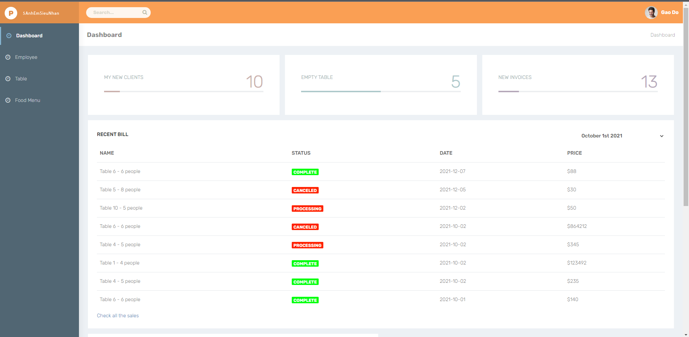
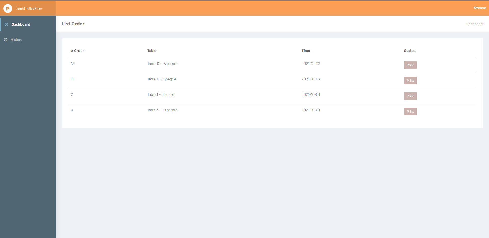

# SWP391
Project on SWP391: RESTAURANT MANAGEMENT SYSTEM

Backlog : https://docs.google.com/spreadsheets/d/1N9Gh48MRZeLFAHYnZfOA29mcan1PDXK8PtNaIoYxbBs/edit?usp=sharing

SRS : https://docs.google.com/document/d/1L8kwDqItDRjj6RqpzoiIzQhSlou0ScjbDdXWGay9bXQ/edit?usp=sharing

Software Design Document: https://docs.google.com/document/d/1ptD3rnAzXXM5NbDzqmgAdlpuu_FNEaNrAK76FZ-dyGA/edit?usp=sharing

Figma : https://www.figma.com/file/xlFu6AAC2HnlhjJw7uzU2T/Feature?node-id=1%3A105

Database Diagram: https://drive.google.com/file/d/1X9Ukjl97fbX5kpnX_N-qSPMbfyUFuCJF/view?usp=sharing

# Member
| Role  | Name | Roll Number |
| ------------- | ------------- | ------------- |
| Leader  | Nguyễn Xuân Cảm  | DE150007 |
| Member  | Nguyễn Thị Diễm Hà  | DE150072 |
| Member  | Lê Hồng Bảo Ngân  | DE150159 |
| Member  | Võ Đình Minh Quang | DE150216 |
| Member  |  Nguyễn Minh Quân  | DE150026 |
| Member  |  Võ Nguyễn Đình Trí  | DE150031 |

# DEMO
  -  Manager Dashboard
  
  - Chef Dashboard
  
  
